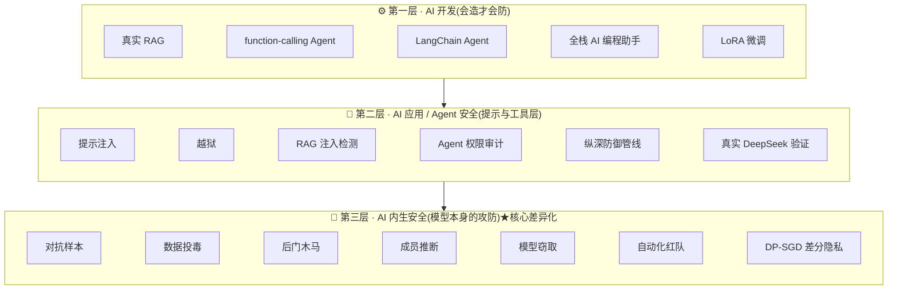
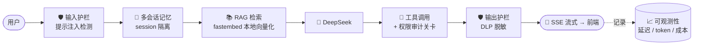
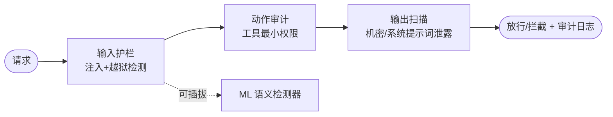

<div align="center">

# 🛡️ AI 安全作品集 · AI Security Portfolio

**从传统安全到 AI 安全的全栈转型作品集 —— 会造 AI · 会防应用 · 会攻防模型本身**

[](https://github.com/Landjun/ai-security-portfolio/actions/workflows/ci.yml)


<em>把每一次学习都沉淀成 <strong>可运行代码 · 量化结果 · 可复现环境 · 面试表达</strong>。</em>

</div>

---

## 📊 一眼看懂(量化战绩 · 面试可直接报数)

| 维度 | 战绩 | 项目 |
|---|---|---|
| 🔴 红队 → 根治 | 注入检测绕过率 **53% → 0%**(零误报) | [ML 语义注入检测器](03-agent-rag-security/ml-injection-detector/) |
| 🕵️ 隐私攻击 | 成员推断 **AUC 0.93 → 0.56**(正则化抑制) | [成员推断](07-ai-intrinsic-security/membership-inference/) |
| 🪞 模型窃取 | 黑盒查询蒸馏 **保真度 95%** | [模型窃取](07-ai-intrinsic-security/model-extraction/) |
| 🎭 隐蔽后门 | 干净准确率 **100%** 仍可被触发器激活 → 自动揪出 | [后门攻击](07-ai-intrinsic-security/backdoor-attack/) |
| ☠️ 数据投毒 | 准确率 **100% → 62% → 100%**(检测清洗恢复) | [数据投毒](07-ai-intrinsic-security/data-poisoning/) |
| 🛡️ 工程化收口 | 注入/越狱/审计/输出统一中间件 + HTTP API | [LLM 安全网关](03-agent-rag-security/llm-security-gateway/) |
| 🤖 全栈 AI 应用 | 对话/记忆/RAG/工具/护栏/Web/可观测性一体 | [AI 编程助手「码小安」](06-ai-development/ai-coding-helper/) |
| ✅ 质量保障 | **34 个安全单元测试 + GitHub Actions CI** 常绿 | [tests/](tests/) |

> **45+ 可运行子项目 · 纯 Python · 模型层实验零 GPU · 应用层 demo 多数零依赖零 Key。**

---

## 🧱 能力三层地图



> 一句话:**会开发 AI · 会防应用层 · 会攻防模型本身**——三层都有可运行代码与量化结果。
> 📌 [项目地图 + STAR 故事集](05-resume-interview/project-map.md) · [JD 能力对照](05-resume-interview/jd-capability-map.md) · [成长路线 ROADMAP](ROADMAP.md)

---

## ⭐ 旗舰项目聚焦

### 1️⃣ AI 编程助手「码小安」—— 全栈 AI 应用 × 安全一体化 · [代码](06-ai-development/ai-coding-helper/)

> 对标 LangChain4j 实战教程,用 Python 复刻并扩展。一个项目打通「AI 应用开发」与「AI 安全」。



### 2️⃣ LLM 安全网关 —— 把所有检测器收口成可插拔中间件 · [代码](03-agent-rag-security/llm-security-gateway/)



### 3️⃣ Python 答疑客服(旗舰落地)· [代码](04-ops-ai-efficiency/python-ta-rag/)

> 可替代助教的 RAG 智能客服:86 篇知识库 + **四道护栏**(防幻觉 / 防注入 / 合规 / 引用溯源),20 条标注集评测正确率 **95%**。命令行 + 网页双界面。

---

## 📂 模块导航

| 模块 | 方向 | 规模 |
|------|------|------|
| [01 传统安全](01-traditional-security/) | Web/系统漏洞:原理→复现→防护→检测 | ✅ 8 靶场 + 31 单测 |
| [02 AI 安全](02-ai-security/) | 提示注入/越狱 + OWASP LLM Top 10 全覆盖 | ✅ 9 个案例 |
| [03 Agent / RAG 安全](03-agent-rag-security/) | RAG/Agent 攻防工具、安全网关、评测体系、代码审计 | ✅ 11 个工具 |
| [04 运营 AI 提效](04-ops-ai-efficiency/) | 真实业务的 AI 自动化(含答疑客服旗舰) | ✅ 3 个案例 |
| [05 简历与面试](05-resume-interview/) | 简历话术、JD 对照、STAR 故事、投递模板 | ✅ 持续更新 |
| [06 AI 开发](06-ai-development/) | 真实 RAG / Agent / LangChain / 微调 / 全栈助手 | ✅ 6 个项目 |
| [07 AI 内生安全](07-ai-intrinsic-security/) | 对抗/投毒/后门/成员推断/模型窃取/红队/DP-SGD | ✅ 7 个实验 |
| [08 区块链安全](08-blockchain-security/) | 9 类智能合约漏洞对照 + Python 静态审计扫描器 + 审计报告 | ✅ 9 漏洞 + 扫描器 |

---

## 🚀 快速开始

```bash
git clone https://github.com/Landjun/ai-security-portfolio
cd ai-security-portfolio

# 应用层安全 demo(无需任何依赖 / Key)
python 02-ai-security/prompt-injection/demo.py

# AI 内生安全(需 scikit-learn)
python 07-ai-intrinsic-security/backdoor-attack/demo.py

# 安全模块单元测试(纯规则,秒级)
python -m unittest discover -s tests -v
```

---

## ✅ 可运行案例全景

<details>
<summary><strong>点开查看全部 25+ 可运行案例(按方向分组)</strong></summary>

| 案例 | 方向 | 看点 |
|------|------|------|
| [提示注入](02-ai-security/prompt-injection/) | AI 安全 | "忽略指令"劫持泄露系统提示词 → 输入护栏拦截 |
| [越狱 Jailbreak](02-ai-security/jailbreak/) | AI 安全 | 角色扮演/DAN 绕过 → 越狱检测+拒答加固 |
| [RAG 注入检测器](03-agent-rag-security/rag-injection-detector/) | Agent/RAG | 知识库投毒劫持模型 → 可扫描文件的注入检测 |
| [Agent 工具权限审计](03-agent-rag-security/tool-permission-audit/) | Agent/RAG | 越权转账/删库 → 最小权限审计拦截(LLM06) |
| [端到端安全 Agent 管线](03-agent-rag-security/secure-agent-pipeline/) | Agent/RAG | 纵深防御:任一层失守另一层兜底(LLM01+06) |
| [真实 RAG 系统](06-ai-development/real-rag-system/) | AI 开发 | 本地 embedding 检索 + DeepSeek 生成 |
| [真实 LLM 注入攻防验证](03-agent-rag-security/real-rag-injection/) | 开发×安全 | 真实 DeepSeek 被劫持 → 检测器源头剔除(v1被绕过→v2加固) |
| [真实 Agent](06-ai-development/real-agent/) | AI 开发 | DeepSeek function calling 完整 ReAct 循环 |
| [文本对抗样本](07-ai-intrinsic-security/text-adversarial/) | 内生安全 | 形近字+拆字让分类器判错 → 对抗训练加固 |
| [数据投毒](07-ai-intrinsic-security/data-poisoning/) | 内生安全 | 6 条毒样本 100%→62% → kNN 检测恢复(LLM03) |
| [后门/木马攻击](07-ai-intrinsic-security/backdoor-attack/) | 内生安全 | 秘密触发器隐蔽埋后门 → 翻转测试自动揪出 |
| [成员推断攻击](07-ai-intrinsic-security/membership-inference/) | 内生安全·隐私 | 自信度判断是否被训练 AUC 0.93 → 0.56 |
| [差分隐私训练 DP-SGD](07-ai-intrinsic-security/dp-sgd/) | 内生安全·隐私 | 手写裁剪+加噪,量化隐私-效用权衡 |
| [模型窃取](07-ai-intrinsic-security/model-extraction/) | 内生安全 | 黑盒蒸馏保真度 95% → 限流/扰动防御 |
| [自动化红队](07-ai-intrinsic-security/auto-redteam/) | 内生安全 | 批量变体轰炸,量化绕过率 31% 定位弱点 |
| [ML 语义注入检测器](03-agent-rag-security/ml-injection-detector/) | 开发×安全 | embedding+LR 把绕过率 53%→0%、零误报 |
| [真实 Agent 越权攻防](03-agent-rag-security/real-agent-audit/) | 开发×安全 | 真实 Agent 被劫持越权退款 → 执行前拦截 |
| [LLM 安全网关](03-agent-rag-security/llm-security-gateway/) | 工程化 | 输入/动作/输出三关卡统一中间件 + HTTP API |
| [AI 系统安全评测体系](03-agent-rag-security/ai-security-assessment/) | 评测体系 | 资产→威胁→用例库→评级→报告 |
| [AI Agent 代码审计](03-agent-rag-security/agent-code-audit/) | 代码审计 | 7 类漏洞 + 扫描器 + 报告 + 修复闭环(8→0) |
| [多智能体安全](03-agent-rag-security/multi-agent-security/) | 前沿 | 跨智能体注入传播 → 净化+最小权限纵深防御 |
| [MCP 安全](03-agent-rag-security/mcp-security/) | 前沿·协议 | 工具描述投毒/rug-pull 检测 + 指纹 pin |
| [AI 编程助手「码小安」](06-ai-development/ai-coding-helper/) | 全栈开发×安全 | 对话/记忆/RAG/工具+审计/护栏/SSE Web/可观测性 |
| [LangChain Agent](06-ai-development/langchain-agent/) | AI 开发 | LangChain+DeepSeek 工具调用 + 权限审计 |
| [AI 赋能安全自动化](06-ai-development/ai-assisted-security/) | 开发×安全 | AI 辅助漏洞情报 + AI 辅助代码审计 |
| [LoRA 微调(numpy手写)](06-ai-development/lora-finetune/) | AI 开发 | 手写低秩适配,6% 参数逼近全量微调 |
| [Python 答疑客服](04-ops-ai-efficiency/python-ta-rag/) | 业务落地 | 86 篇知识库 + 四道护栏,评测正确率 95% |
| [传统安全靶场 ×8](01-traditional-security/) | 传统安全 | SQLi/XSS/命令注入/路径穿越/SSRF/上传/反序列化/SSTI |
| [智能合约审计 ×9](08-blockchain-security/) | 区块链安全 | 9 类漏洞对照 + Python 静态扫描器(8/8命中)+ 审计报告 |

</details>

> 全部纯 Python、本地一条命令即可复现攻击与防御;多数应用层 demo 零依赖、无需 API Key。

---

## ✍️ 文章与表达输出

- [当 AI Agent 被劫持:用纵深防御守住"会动手的模型"](articles/agent-security-defense-in-depth.md)
- [纯 Python 复现 AI 内生安全的六大攻击面](articles/ai-intrinsic-security-six-attacks.md)
- [我做了一个"会拒绝学员"的 Python 答疑 AI](articles/python-ta-rag-build.md)
- [从"手动发现"到"自动根治":一次完整的 LLM 注入攻防闭环](articles/real-llm-injection-closed-loop.md)
- [AI 安全评测:从"会单点攻击"到"能体系化交付"](articles/ai-security-assessment-system.md)
- 📂 求职配套:[投递话术](05-resume-interview/hr-outreach.md) · [JD 缺口分析](05-resume-interview/jd-gap-analysis.md) · [简历项目段](05-resume-interview/resume-project-section.md) · [面试口播稿](05-resume-interview/talk-deck-outline.md)

---

## 🧭 每个案例的统一结构

> **原理 → 复现环境 → 防护方案 → 修复建议 → 检测清单 → 面试表达**(六步法,作品集 → 简历的转换器)

## ⚠️ 安全边界

本仓库所有内容**仅用于本地靶场、授权环境、学习与防御研究**,不包含针对真实第三方目标的攻击脚本。

<div align="center">
<sub>MVP 优先 · 每一步可运行可验证 · 每个产出对应一句简历话术</sub>
</div>
